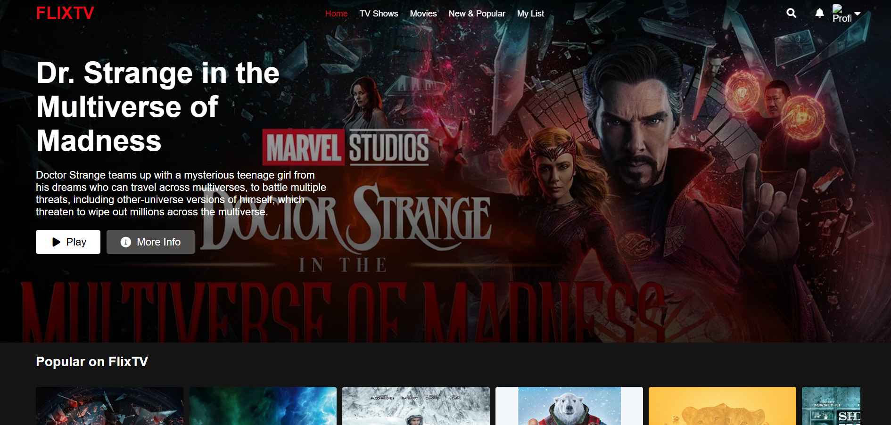
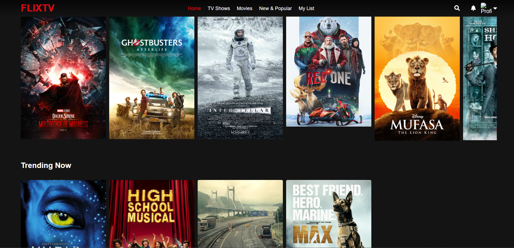
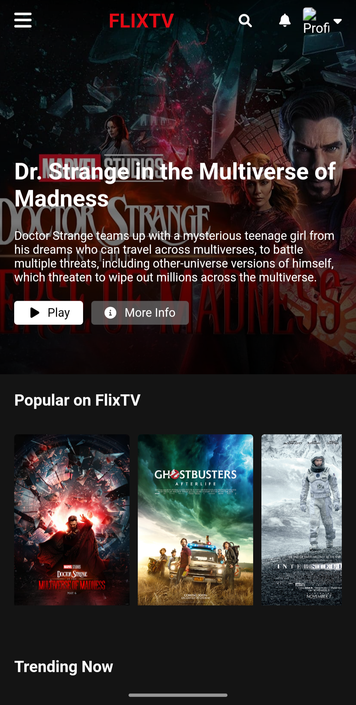

# FlixTV 🎬📺  
FlixTV is a Netflix-inspired streaming platform that allows users to browse, search, and experience a stunning UI theme similar to Netflix. Designed with pure HTML, CSS, and JavaScript, it offers a sleek, responsive, and immersive user interface that adapts seamlessly to all screen sizes.  

## Live Demo 🚀
[Click here to try FlixTV](https://jason3105.github.io/Flix-TV/)

## Features ✨
🎭 Netflix-like UI with a modern and polished design  
📱 Fully Responsive for all devices (mobile, tablet, desktop)  
🔍 Browse & Search through movie collections  
⭐ Smooth Hover Effects for a cinematic feel  
🌙 Dark Theme for an immersive experience  

## Technologies Used 🛠️

  HTML
  CSS
   Jvascript

## Installation 🚀
1. Clone the repository:
   <pre>git clone https://github.com/your-username/Flix-TV.git</pre>
2. Navigate to the project directory:
   <pre>cd Flix-TV</pre>
3. Open index.html in a browser to view the project.

## Project Structure 📂
<pre>flixTV/
│── Images/        # Folder containing images and assets
│── index.html     # Main HTML file
│── style.css      # Stylesheet for design and responsiveness
│── script.js      # JavaScript file for interactivity
│── tvshow.html    # Additional HTML file for TV shows
│── README.md      # Project documentation
</pre>

## Screenshots 📸
  

  

  
